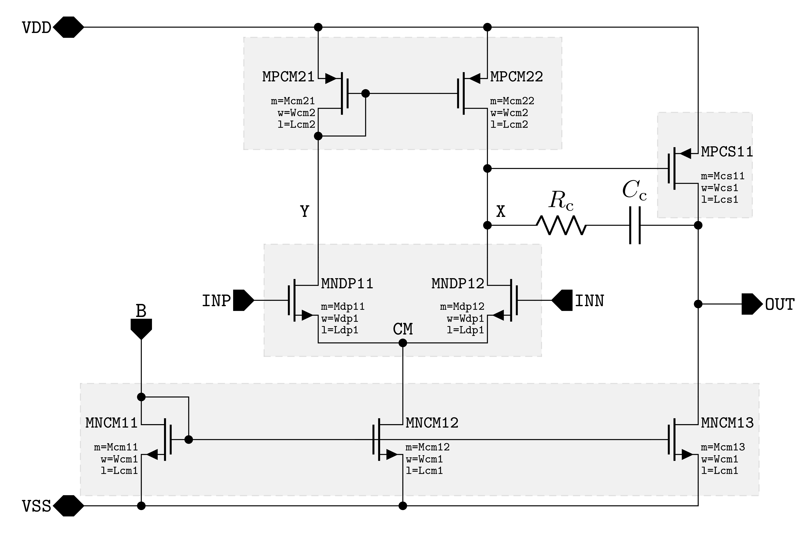

### Miller Amplifier (MIL)



Available via `circus` constructor with `circus:mil-<pdk>-<space>-<variant>`.

#### Observation Space

By default, the `observation` space is set to `'perf'` via the `obs_filter`
kwarg. If it is set to `'all'` the shape will be `(159,)` instead. Otherwise it
will be the length of the given list. Same goes for the goal space.

```python
# v0
gym.spaces.Dict({ 'observation':   Box( -np.Inf, np.Inf, (29,))
                , 'achieved_goal': Box( -np.Inf, np.Inf, (23,))
                , 'desired_goal':  Box( -np.Inf, np.Inf, (23,))
                , })

# v1
gym.spaces.Box( low   = -np.inf
              , high  = np.inf
              , shape = (29,)
              , dtype = np.float32
              , )

```

#### Action Space 

| Variant | Shape    | Parameters                                                                                                                                                   |
|---------|----------|--------------------------------------------------------------------------------------------------------------------------------------------------------------|
| `elec`  | `(10, )` | `['MNCM1R:gmoverid', 'MPCM2R:gmoverid', 'MPCS1:gmoverid', 'MND1A:gmoverid', 'MNCM1R:fug', 'MPCM2R:fug', 'MPCS1:fug', 'MND1A:fug', 'MNCM1A:id', 'MNCM1B:id']` |
| `geom`  | `(19, )` | `['Wres', 'Mcap', 'Wcs', 'Wd', 'Lres', 'Wcap', 'Mcm13', 'Mcm12', 'Md', 'Lcm2', 'Ld', 'Wcm2', 'Wcm1', 'Mcm11', 'Mcm22', 'Mcs', 'Lcs', 'Mcm21', 'Lcm1']`       |

The parameter identifiers can be obtained through the `input_parameters` field
of the environment.

```python
# elec
gym.spaces.Box( low   = -1.0
              , high  = 1.0
              , shape = (10,)
              , dtype = np.float32
              , )

# geom
gym.spaces.Box( low   = -1.0
              , high  = 1.0
              , shape = (19,)
              , dtype = np.float32
              , )
```

