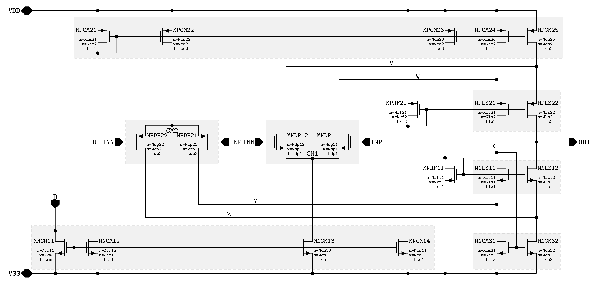

### Rail-To-Rail Folded Cascode Amplifier with Wide-Swing Current Mirror (RFA)



Available via `circus` constructor with `circus:rfa-<pdk>-<space>-<variant>`.

#### Observation Space

By default, the `observation` space is set to `'perf'` via the `obs_filter`
kwarg. If it is set to `'all'` the shape will be `(368,)` instead. Otherwise it
will be the length of the given list. Same goes for the goal space.

```python
# v0
gym.spaces.Dict({ 'observation':   Box( -np.Inf, np.Inf, (29,))
                , 'achieved_goal': Box( -np.Inf, np.Inf, (23,))
                , 'desired_goal':  Box( -np.Inf, np.Inf, (23,))
                , })

# v1
gym.spaces.Box( low   = -np.inf
              , high  = np.inf
              , shape = (29,)
              , dtype = np.float32
              , )

```

#### Action Space 


| Variant | Shape    | Parameters                                                                                                                                                                                                                                                                                                                                                       |
|---------|----------|------------------------------------------------------------------------------------------------------------------------------------------------------------------------------------------------------------------------------------------------------------------------------------------------------------------------------------------------------------------|
| `elec`  | `(23, )` | `['MND11:gmoverid', 'MPD21:gmoverid', 'MNCM11:gmoverid', 'MNLS11:gmoverid', 'MNR1:gmoverid', 'MPCM21:gmoverid', 'MPR2:gmoverid', 'MPCM31:gmoverid', 'MNCM41:gmoverid', 'MND11:fug', 'MPD21:fug', 'MNCM11:fug', 'MNLS11:fug', 'MNR1:fug', 'MPCM21:fug', 'MPR2:fug', 'MPCM31:fug', 'MNCM41:fug', 'MNCM43:id', 'MNCM32:id', 'MNCM44:id', 'MPCM33:id', 'MPCM34:id']` |
| `geom`  | `(31, )` | `['Lr1', 'Lr2', 'Wr2', 'Wr1', 'Ld1', 'Lcm2', 'Lcm3', 'Lls1', 'Lcm4', 'Md2', 'Ld2', 'Md1', 'Mcm44', 'Mcm43', 'Mcm42', 'Lcm1', 'Mcm41', 'Wd2', 'Wd1', 'Mcm34', 'Wcm2', 'Wcm1', 'Mls1', 'Wls1', 'Wcm4', 'Wcm3', 'Mcm33', 'Mcm32', 'Mcm1', 'Mcm31', 'Mcm2']`                                                                                                         |

The parameter identifiers can be obtained through the `input_parameters` field
of the environment.

```python
# elec
gym.spaces.Box( low   = -1.0
              , high  = 1.0
              , shape = (23,)
              , dtype = np.float32
              , )

# geom
gym.spaces.Box( low   = -1.0
              , high  = 1.0
              , shape = (31,)
              , dtype = np.float32
              , )
```

